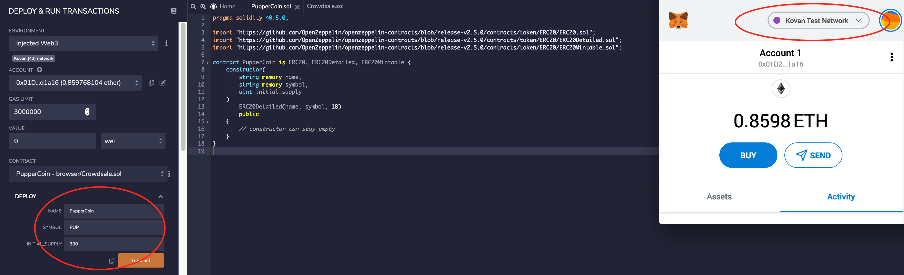

# Token Crowdsale with Solidity 


## Contracts
<details>

<summary>PupperCoin.sol</summary>

`PupperCoin.sol` was written to create a `ERC20Mintable` token.
* Standard `ERC20Mintable` and `ERC20Detailed` contract
* Hardcoding `18` as the `decimals` parameter and `initial_supply` parameter alone

</details>

<details>

<summary>Crowdsale.sol</summary>

`Crowdsale.sol` is a contract prepared like a standard crowdsale.
* Inheriting the following OpenZeppelin contracts:\
`Crowdsale`, `MintedCrowdsale`, `CappedCrowdsale`,`TimedCrowdsale`, `RefundablePostDeliveryCrowdsale`

* Provide parameters for all of the features of crowdsale, such as the `name`, `symbol`, `wallet` for fundraising, `goal`.

* Hardcode a `rate` of 1, to maintain parity with Ether units (1 TKN per Ether, or 1 TKNbit per wei). To customize crowdsale rate, follow the [Crowdsale Rate](https://docs.openzeppelin.com/contracts/2.x/crowdsales#crowdsale-rate) calculator on OpenZeppelin's documentation. Essentially, a token (TKN) can be divided into TKNbits just like Ether can be divided into wei. When using a `rate` of 1, just like 1000000000000000000 wei is equal to 1 Ether, 1000000000000000000 TKNbits is equal to 1 TKN.

* Since `RefundablePostDeliveryCrowdsale` inherits the `RefundableCrowdsale` contract, which requires a `goal` parameter, the `RefundableCrowdsale` constructor must be called from `PupperCoinCrowdsale` constructor as well as the others. `RefundablePostDeliveryCrowdsale` does not have its own constructor, so just use the `RefundableCrowdsale` constructor that it inherits.

* If one forgets to call the `RefundableCrowdsale` constructor, the `RefundablePostDeliveryCrowdsale` will fail since it relies on it (it inherits from `RefundableCrowdsale`), and does not have its own constructor.

* When passing the `open` and `close` times, use `now` and `now + 24 weeks` to set the times properly from `PupperCoinCrowdsaleDeployer` contract.

</details> 

## Testing

Test the crowdsale by sending Ether to the crowdsale from a different account (not the same account that is raising funds), then crowdsale works as expected is confirmed, try to add the token to MyCrypto and test a transaction.

In order to test the time functionality, replace `now` with `fakenow`, and create a setter function to modify `fakenow` to whatever time want to simulate. Set the `close` time to be `now + 5 minutes`, or whatever timeline (eg. 5 minutes) to test for a shorter crowdsale.

```
PupperCoinSale pupper_token = new PupperCoinSale(1, wallet, token, goal, cap, fakenow, now + 5 minute);
```

## Deployment

1. Open Ganache and Metamask, change the network to Kovan.

2. Deploying `PupperCoin`

<details>
<summary></summary>



Paramaters required for deployment: `name`, `symbol`, and `initial_supply`.

</details>

3. Deploying `ShareCoinSaleDeployer`

<details>
<summary></summary>


Parameters required: `name`, `symbol`, `wallet` (Same as your Wallet Address), `goal`, and `cap`.

</details>

4. Deploying `PupperCoinSale` contract with `token_sale_address` in the `At_Address` section

<details>
<summary></summary>


</details>

5. Deploying `PupperCoin` contract with `token_Address` in the `At_Address` section

<details>
<summary></summary>


</details>


